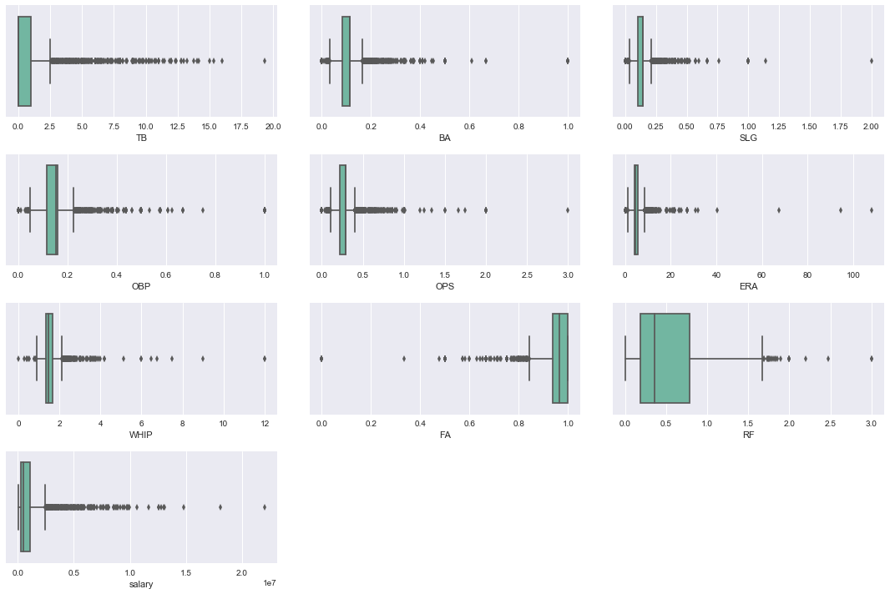
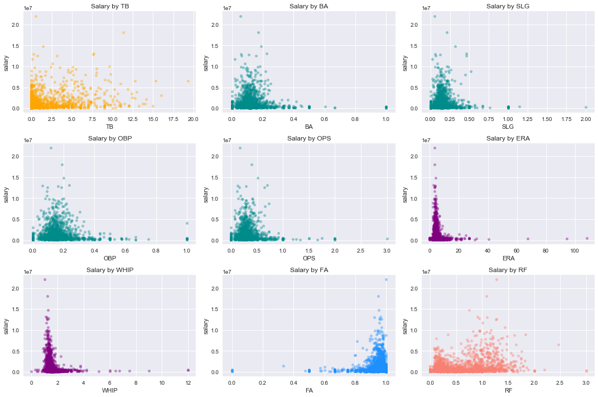
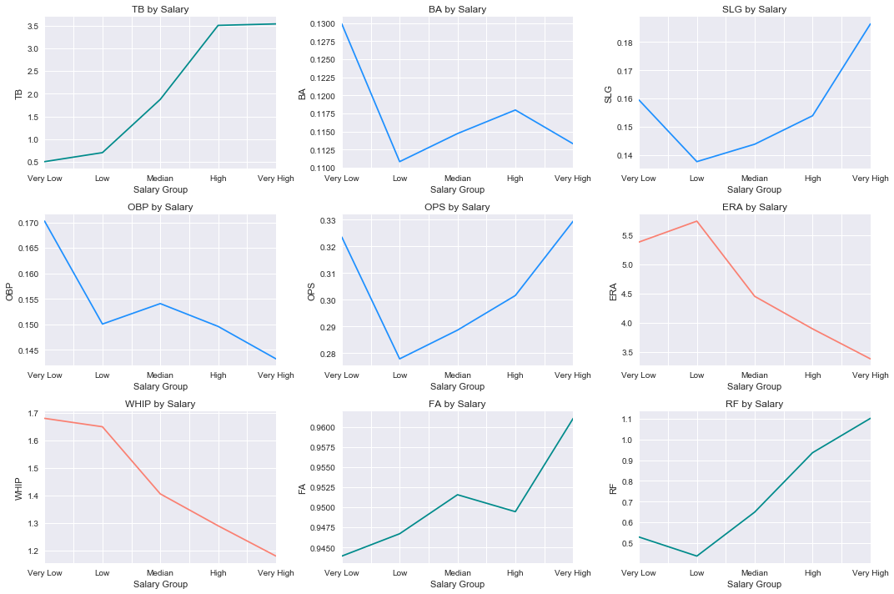
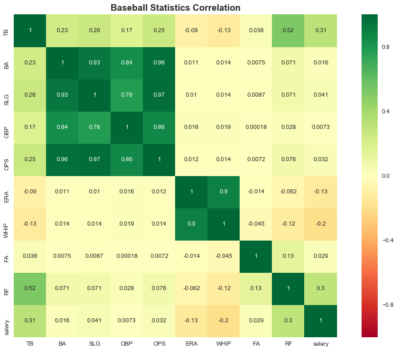
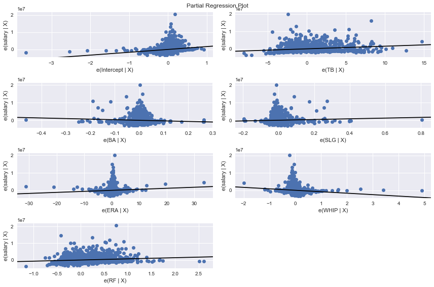
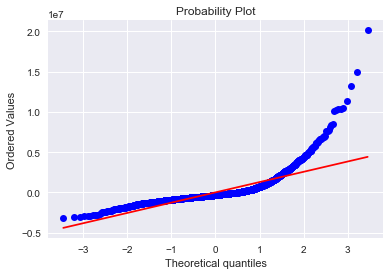

# Investigate a Dataset: Does Performance Determine  Baseball Player Salary?

## Zexin Xia 

### April 09, 2017

## Introduction

Baseball statistics provide a direct measure of a player's performance and contributions to his team, and **the goal of this project is to investigate whether the baseball statistics are significantly useful in determining a player's salary**. The data for this project were obtained from the [Lahman’s Baseball Database](http://www.seanlahman.com/baseball-archive/statistics/), which contains complete batting and pitching statistics from 1871 to 2016, plus fielding statistics, standings, team stats, managerial records, post-season data, and more.

## Variables for Investigation

The investigation focuses on exploring the relationship between player salary (dependent variable) and the following nine commonly used statistics (independent variables) in baseball: 

1). **Total Bases (TB)** - the number of bases a player has gained with hits.

$$TB = H + 2B + (2 × 3B) + (3 × HR)$$

* H = Hits
* 2B = Doubles
* 3B = Triples
* HR = Homeruns

2). **Batting Average (BA)** - a measure of a palyer's batting ability.
     
$$BA = \frac{H}{AB}$$
      
* H = Hits
* AB = At Bats

3). **Slugging percentage (SLG)** - a popular measure of the power of a hitter.

$$SLG = \frac{TB}{AB}$$

* TB = Total Bases
* AB = At Bats

4). **On-base percentage (OBP)** -  a measure of how often a batter reaches base for any reason other than a fielding      error, fielder's choice, dropped/uncaught third strike, fielder's obstruction, or catcher's interference.

$$OBP = \frac{H + BB + HBP}{AB + BB +HBP + SF}$$

* H = Hits
* BB = Base on Balls (walks)
* HBP = Hit by Pitch
* AB = At Bats
* SF = Sacrifice Flies

5). **On-base plus slugging (OPS)** - a measure of the ability of a player both to get on base and to hit for power.

$$OPS = OBP + SLG$$
 
* OBP = On-base percentage
* SLG = Slugging percentage

6). **Fielding Average (FA)** - a measurement that reflects the percentage of times a defensive player properly handles a batted or thrown ball. 

$$FA = \frac{PO + A}{PO + A + E}$$

* PO = Putouts
* A = Assists
* E = Errors

7). **Range Factor (RF)** - used to determine the amount of field that the player can cover.

$$RF = \frac{A + PO}{G}$$

* A = Assists
* PO = Putouts
* G = Games played

8). **Walks-plus-Hits-per-Inning-Pitched (WHIP)** - a measurement of the number of baserunners a pitcher has allowed per inning pitched.

$$WHIP = \frac{BB + H}{IPouts/3}$$

* BB = Walks
* H = Hits
* IPouts = Outs Pitched (innings pitched x 3)

9). **Earned Run Average (ERA)** -  is the mean of earned runs given up by a pitcher per nine innings pitched.

$$ERA = 9 \times \frac{Eared Runs Allowed}{Innings Pitched}$$

**Note**  - This statistic can be obtained directly from the baseball data from the Lahman’s Baseball Database.
 


## Data Wrangling

Except for the ERA all other player statistics cannot be obtained directly from the Lahman’s Baseball Database; however, they can be calculated using the equations from the previous section since the database contains all the components of the equations. For the purpose of our investigation, we need a total of four csv files from the database:

* Batting.csv
* Fielding.csv
* Pitching.csv
* Salaries.csv

Our goal is to build a cleaned dataset containing only the variables of our interest, and the data wrangling process is carried out using the following Python codes: 

**1). Load csv Files**


```python
# Import the pandas module.
import pandas as pd

# Read the csv files for Batting, Fielding, Pitching, and salary into DataFrames.
Batting_pd = pd.read_csv('Batting.csv')
Fielding_pd = pd.read_csv('Fielding.csv')
Pitching_pd = pd.read_csv('Pitching.csv')
Salaries_pd = pd.read_csv('Salaries.csv')

# Show the first observation of each DataFrame.
print(Batting_pd.head(1))
print('')
print(Fielding_pd.head(1))
print('')
print(Pitching_pd.head(1))
print('')
print(Salaries_pd.head(1))
print('')
```

        playerID  yearID  stint teamID lgID  G  AB  R  H  2B  ...   RBI   SB   CS  \
    0  abercda01    1871      1    TRO  NaN  1   4  0  0   0  ...   0.0  0.0  0.0   
    
       BB   SO  IBB  HBP  SH  SF  GIDP  
    0   0  0.0  NaN  NaN NaN NaN   NaN  
    
    [1 rows x 22 columns]
    
        playerID  yearID  stint teamID lgID POS  G  GS  InnOuts  PO    A    E  \
    0  abercda01    1871      1    TRO  NaN  SS  1 NaN      NaN   1  3.0  2.0   
    
        DP  PB  WP  SB  CS  ZR  
    0  0.0 NaN NaN NaN NaN NaN  
    
        playerID  yearID  stint teamID lgID  W  L  G  GS  CG  ...   IBB  WP  HBP  \
    0  bechtge01    1871      1    PH1  NaN  1  2  3   3   2  ...   NaN NaN  NaN   
    
       BK  BFP  GF   R  SH  SF  GIDP  
    0   0  NaN NaN  42 NaN NaN   NaN  
    
    [1 rows x 30 columns]
    
       yearID teamID lgID   playerID  salary
    0    1985    ATL   NL  barkele01  870000
    


```python
# Count the number of obsevations in each DataFrame.
print(len(Batting_pd))
print(len(Fielding_pd))
print(len(Pitching_pd))
print(len(Salaries_pd))
```

    102816
    136815
    44963
    26428


**2). Handling Missing Values**

As you can see, there are many missing values (NaNs) in our data, and if obervations with missing values are removed direclty from the four DataFrames, then we might lose information that are important to us when analyzing the data. Therefore, we fill in the missing values of all numeric variables with the average value of the variables. 


```python
# Create a function to replace NaN with mean.
def Replace_NaN_with_Mean(df):
    return df.fillna(df.mean(), inplace = True).head(1)

# Replace all the NaN values in each numeric column with the average of the column for all DataFrames.
print(Replace_NaN_with_Mean(Batting_pd))
print('')
print(Replace_NaN_with_Mean(Fielding_pd))
print('')
print(Replace_NaN_with_Mean(Pitching_pd))
print('')
print(Replace_NaN_with_Mean(Salaries_pd))
```

        playerID  yearID  stint teamID lgID  G  AB  R  H  2B    ...     RBI   SB  \
    0  abercda01    1871      1    TRO  NaN  1   4  0  0   0    ...     0.0  0.0   
    
        CS  BB   SO      IBB       HBP       SH        SF      GIDP  
    0  0.0   0  0.0  1.10587  1.056057  2.29954  1.054101  2.981018  
    
    [1 rows x 22 columns]
    
        playerID  yearID  stint teamID lgID POS  G         GS     InnOuts  PO  \
    0  abercda01    1871      1    TRO  NaN  SS  1  26.680626  716.201693   1   
    
         A    E   DP        PB         WP         SB         CS        ZR  
    0  3.0  2.0  0.0  5.147996  11.772977  24.859726  12.005865  0.703032  
    
        playerID  yearID  stint teamID lgID  W  L  G  GS  CG   ...          IBB  \
    0  bechtge01    1871      1    PH1  NaN  1  2  3   3   2   ...     2.411379   
    
             WP       HBP  BK         BFP       GF   R        SH        SF  \
    0  2.528575  2.266096   0  343.312181  6.34526  42  2.141922  1.878388   
    
          GIDP  
    0  5.32261  
    
    [1 rows x 30 columns]
    
       yearID teamID lgID   playerID  salary
    0    1985    ATL   NL  barkele01  870000


**3). Create Batting Statistics DataFrame**


```python
# Create variables TB, BA, SLG, OBP, and OPS, and them append them to the Batting DataFrame.
Batting_pd['TB'] = (Batting_pd['H'] + Batting_pd['2B'] + Batting_pd['3B'] * 2 + Batting_pd['HR'] * 3)
Batting_pd['BA'] = Batting_pd['H'] / Batting_pd['AB']
Batting_pd['SLG'] = (Batting_pd['TB'] / Batting_pd['AB'])
Batting_pd['OBP'] = ((Batting_pd['H'] + Batting_pd['BB'] + Batting_pd['HBP']) / 
                  (Batting_pd['AB'] + Batting_pd['BB'] + Batting_pd['HBP'] + Batting_pd['SF']))
Batting_pd['OPS'] = (Batting_pd['SLG'] + Batting_pd['OBP'])
```


```python
# Remove all the variables from the Batting DataFrame that are not needed for our analysis 
# and store the rest of the variables in Batting_Stats_pd. 
Batting_Stats_pd = Batting_pd.filter(['playerID','yearID','stint','teamID','lgID','G',
                                   'TB','BA','SLG','OBP','OPS'], axis=1)

# Show the first observation of the Batting Statistics DataFrame excluding the unwanted varaibles.
Batting_Stats_pd.head(1)
```


<div>
<table border="1" class="dataframe">
  <thead>
    <tr style="text-align: right;">
      <th></th>
      <th>playerID</th>
      <th>yearID</th>
      <th>stint</th>
      <th>teamID</th>
      <th>lgID</th>
      <th>G</th>
      <th>TB</th>
      <th>BA</th>
      <th>SLG</th>
      <th>OBP</th>
      <th>OPS</th>
    </tr>
  </thead>
  <tbody>
    <tr>
      <th>0</th>
      <td>abercda01</td>
      <td>1871</td>
      <td>1</td>
      <td>TRO</td>
      <td>NaN</td>
      <td>1</td>
      <td>0</td>
      <td>0.0</td>
      <td>0.0</td>
      <td>0.172836</td>
      <td>0.172836</td>
    </tr>
  </tbody>
</table>
</div>


**4). Create Fielding Statistics DataFrame**


```python
# Create variables FA and RF, and then append them to the Fielding DataFrame.
Fielding_pd['FA'] = ((Fielding_pd['PO'] + Fielding_pd['A']) / 
                     (Fielding_pd['PO'] + Fielding_pd['A'] + Fielding_pd['E']))
Fielding_pd['RF'] = ((Fielding_pd['A'] + Fielding_pd['PO']) / Fielding_pd['G'])
```


```python
# Remove all the variables from the Fielding DataFrame that are not needed for our analysis 
# and store the rest of the variables in Batting_Stats_pd. 
Fielding_Stats_pd = Fielding_pd.filter(['playerID','yearID','stint','teamID','lgID','G','FA','RF'], axis=1)

# Show the first observation of the Fielding DataFrame excluding the unwanted varaibles.
Fielding_Stats_pd.head(1)
```


<div>
<table border="1" class="dataframe">
  <thead>
    <tr style="text-align: right;">
      <th></th>
      <th>playerID</th>
      <th>yearID</th>
      <th>stint</th>
      <th>teamID</th>
      <th>lgID</th>
      <th>G</th>
      <th>FA</th>
      <th>RF</th>
    </tr>
  </thead>
  <tbody>
    <tr>
      <th>0</th>
      <td>abercda01</td>
      <td>1871</td>
      <td>1</td>
      <td>TRO</td>
      <td>NaN</td>
      <td>1</td>
      <td>0.666667</td>
      <td>4.0</td>
    </tr>
  </tbody>
</table>
</div>


**5). Create Pitching Statistics DataFrame**


```python
# Create variables WHIP and then append it to the Pitching DataFrame.
Pitching_pd['WHIP'] = ((Pitching_pd['BB'] + Pitching_pd['H']) / (Pitching_pd['IPouts'] / 3))
```


```python
# Remove all the variables from the Pitching DataFrame that are not needed for our analysis 
# and store the rest of the variables in Pitching_Stats_pd.
Pitching_Stats_pd = Pitching_pd.filter(['playerID','yearID','stint','teamID','lgID','G','ERA','WHIP'], axis=1)

# Show the first observation of the Pitching DataFrame excluding the unwanted varaibles.
Pitching_Stats_pd.head(1)
```


<div>
<table border="1" class="dataframe">
  <thead>
    <tr style="text-align: right;">
      <th></th>
      <th>playerID</th>
      <th>yearID</th>
      <th>stint</th>
      <th>teamID</th>
      <th>lgID</th>
      <th>G</th>
      <th>ERA</th>
      <th>WHIP</th>
    </tr>
  </thead>
  <tbody>
    <tr>
      <th>0</th>
      <td>bechtge01</td>
      <td>1871</td>
      <td>1</td>
      <td>PH1</td>
      <td>NaN</td>
      <td>3</td>
      <td>7.96</td>
      <td>2.076923</td>
    </tr>
  </tbody>
</table>
</div>


```python
print(len(Batting_Stats_pd))
print(len(Fielding_Stats_pd))
print(len(Pitching_Stats_pd))
print(len(Salaries_pd))
```

    102816
    136815
    44963
    26428


**6). Create Player Statistics DataFrame**

Now, we combine all four DataFrames (Batting_Stats_pd, Fielding_Stats_pd, Pitching_Stats_pd, and Salaries_pd) into a single DataFrame that contains all the desired variables for our investigation. 


```python
# Merge the four DataFrames using intersection of keys from the DataFrames and store the result in Player_Stats_pd.
Player_Stats_pd = Fielding_Stats_pd.merge(
    Batting_Stats_pd, how='inner', on=['playerID','yearID','teamID','lgID','stint','G']).merge(
    Pitching_Stats_pd, how='inner', on=['playerID','yearID','teamID','lgID','stint','G']).merge(
    Salaries_pd, how='inner', on=['playerID','yearID','teamID','lgID'])

# Check to see if the merge was done correctly by printing out the first observation of the DataFrame.
Player_Stats_pd.head(1)
```


<div>
<table border="1" class="dataframe">
  <thead>
    <tr style="text-align: right;">
      <th></th>
      <th>playerID</th>
      <th>yearID</th>
      <th>stint</th>
      <th>teamID</th>
      <th>lgID</th>
      <th>G</th>
      <th>FA</th>
      <th>RF</th>
      <th>TB</th>
      <th>BA</th>
      <th>SLG</th>
      <th>OBP</th>
      <th>OPS</th>
      <th>ERA</th>
      <th>WHIP</th>
      <th>salary</th>
    </tr>
  </thead>
  <tbody>
    <tr>
      <th>0</th>
      <td>ackerji01</td>
      <td>1985</td>
      <td>1</td>
      <td>TOR</td>
      <td>AL</td>
      <td>61</td>
      <td>1.0</td>
      <td>0.42623</td>
      <td>0</td>
      <td>NaN</td>
      <td>NaN</td>
      <td>NaN</td>
      <td>NaN</td>
      <td>3.23</td>
      <td>1.494208</td>
      <td>170000</td>
    </tr>
  </tbody>
</table>
</div>


**7). Handling Missing and Non-finite Values**

As shown in the above output , some missing values are introduced when we merged the DataFrames. Here, we will apply the same method as step 2 to handle the missing values. Additionally, there are some non-finite (inf) values that need to be cleaned out in order to avoid  the "LinAlgError" that would occur in our Data Exploration phase. To do this, we first convert all non-finite values to NaNs and then handle the resulted NaNs in the same way as other missing values.


```python
# Import Numpy module.
import numpy as np

# Replace inf values in Player_Stats_pd with NaNs.
Player_Stats_pd.replace([np.inf, -np.inf], np.nan, inplace = True)
```


```python
# Replace all the NaNs in each numeric column with the average of the column in Player_Stats_pd.
Player_Stats_pd.fillna(Player_Stats_pd.mean(), inplace = True).head(1)
```


<div>
<table border="1" class="dataframe">
  <thead>
    <tr style="text-align: right;">
      <th></th>
      <th>playerID</th>
      <th>yearID</th>
      <th>stint</th>
      <th>teamID</th>
      <th>lgID</th>
      <th>G</th>
      <th>FA</th>
      <th>RF</th>
      <th>TB</th>
      <th>BA</th>
      <th>SLG</th>
      <th>OBP</th>
      <th>OPS</th>
      <th>ERA</th>
      <th>WHIP</th>
      <th>salary</th>
    </tr>
  </thead>
  <tbody>
    <tr>
      <th>0</th>
      <td>ackerji01</td>
      <td>1985</td>
      <td>1</td>
      <td>TOR</td>
      <td>AL</td>
      <td>61</td>
      <td>1.0</td>
      <td>0.42623</td>
      <td>0</td>
      <td>0.114938</td>
      <td>0.144367</td>
      <td>0.153576</td>
      <td>0.289276</td>
      <td>3.23</td>
      <td>1.494208</td>
      <td>170000</td>
    </tr>
  </tbody>
</table>
</div>


```python
# Check to see if all NaNs have been removed.
Player_Stats_pd.isnull().sum()
```


    playerID    0
    yearID      0
    stint       0
    teamID      0
    lgID        0
    G           0
    FA          0
    RF          0
    TB          0
    BA          0
    SLG         0
    OBP         0
    OPS         0
    ERA         0
    WHIP        0
    salary      0
    dtype: int64


**8). Create a DataFrame for Unique Players**

The DataFrame Player_Stats_pd contains multiple observations related to the same player, because each player may be playing for different teams and leagues；therefore their salaries may also vary. For our investigation, we calculate the average of each variable of our interest in Player_Stats_pd and store the result in a new DataFrame, namely Mean_Player_Stats_pd, so that each observation will be unique. Mean_Player_Stats_pd will be the final DataFrame for our exploration and analysis.


```python
# Output the number of observations in Player_Stats_pd.
len(Player_Stats_pd)
```


    10676


```python
# Output the number of unique observations in Player_Stats_pd.
len(Player_Stats_pd['playerID'].unique())
```


    2488


```python
# Create the final DataFrame including only varaibles of our interest by taking the average of those variables
# and then store the result in Mean_Player_Stats_pd.
Mean_Player_Stats_pd = Player_Stats_pd.groupby('playerID', as_index=False)[
    'TB','BA','SLG','OBP','OPS','ERA','WHIP','FA','RF','salary'].mean()
# Show the first observation of the DataFrame.
Mean_Player_Stats_pd.head(1)
```


<div>
<table border="1" class="dataframe">
  <thead>
    <tr style="text-align: right;">
      <th></th>
      <th>playerID</th>
      <th>TB</th>
      <th>BA</th>
      <th>SLG</th>
      <th>OBP</th>
      <th>OPS</th>
      <th>ERA</th>
      <th>WHIP</th>
      <th>FA</th>
      <th>RF</th>
      <th>salary</th>
    </tr>
  </thead>
  <tbody>
    <tr>
      <th>0</th>
      <td>aardsda01</td>
      <td>0.0</td>
      <td>0.095782</td>
      <td>0.120306</td>
      <td>0.12798</td>
      <td>0.241063</td>
      <td>5.61</td>
      <td>1.76697</td>
      <td>0.932109</td>
      <td>0.10362</td>
      <td>793291.666667</td>
    </tr>
  </tbody>
</table>
</div>


```python
# Output the number of observations in Mean_Player_Stats_pd.
len(Mean_Player_Stats_pd)
```


    2488


The size of Mean_Player_Stats_pd is equivalent to the number of unique observations in Player_Stats_pd, which means that each observation in Mean_Player_Stats_pd is unique. Now, we can begin to explore this DataFrame.

## Data Exploration

First of all, we want to obtain some descriptive statistics of our data:


```python
# Show descriptive statistics of the DataFrame.
Mean_Player_Stats_pd.describe()
```


<div>
<table border="1" class="dataframe">
  <thead>
    <tr style="text-align: right;">
      <th></th>
      <th>TB</th>
      <th>BA</th>
      <th>SLG</th>
      <th>OBP</th>
      <th>OPS</th>
      <th>ERA</th>
      <th>WHIP</th>
      <th>FA</th>
      <th>RF</th>
      <th>salary</th>
    </tr>
  </thead>
  <tbody>
    <tr>
      <th>count</th>
      <td>2488.000000</td>
      <td>2488.000000</td>
      <td>2488.000000</td>
      <td>2488.000000</td>
      <td>2488.000000</td>
      <td>2488.000000</td>
      <td>2488.000000</td>
      <td>2488.000000</td>
      <td>2488.000000</td>
      <td>2.488000e+03</td>
    </tr>
    <tr>
      <th>mean</th>
      <td>1.082573</td>
      <td>0.112875</td>
      <td>0.140866</td>
      <td>0.151871</td>
      <td>0.283517</td>
      <td>5.344648</td>
      <td>1.577919</td>
      <td>0.947904</td>
      <td>0.511005</td>
      <td>1.081245e+06</td>
    </tr>
    <tr>
      <th>std</th>
      <td>2.280508</td>
      <td>0.082010</td>
      <td>0.105467</td>
      <td>0.096341</td>
      <td>0.185041</td>
      <td>4.068379</td>
      <td>0.550661</td>
      <td>0.081840</td>
      <td>0.418991</td>
      <td>1.668802e+06</td>
    </tr>
    <tr>
      <th>min</th>
      <td>0.000000</td>
      <td>0.000000</td>
      <td>0.000000</td>
      <td>0.000000</td>
      <td>0.000000</td>
      <td>0.000000</td>
      <td>0.000000</td>
      <td>0.000000</td>
      <td>0.000000</td>
      <td>6.000000e+04</td>
    </tr>
    <tr>
      <th>25%</th>
      <td>0.000000</td>
      <td>0.082099</td>
      <td>0.099990</td>
      <td>0.115182</td>
      <td>0.215525</td>
      <td>3.935245</td>
      <td>1.352676</td>
      <td>0.936521</td>
      <td>0.184321</td>
      <td>2.583036e+05</td>
    </tr>
    <tr>
      <th>50%</th>
      <td>0.000000</td>
      <td>0.114938</td>
      <td>0.144367</td>
      <td>0.153576</td>
      <td>0.289276</td>
      <td>4.644375</td>
      <td>1.478416</td>
      <td>0.965594</td>
      <td>0.357143</td>
      <td>5.030000e+05</td>
    </tr>
    <tr>
      <th>75%</th>
      <td>1.000000</td>
      <td>0.114991</td>
      <td>0.144367</td>
      <td>0.159427</td>
      <td>0.289276</td>
      <td>5.740000</td>
      <td>1.661125</td>
      <td>1.000000</td>
      <td>0.785399</td>
      <td>1.141278e+06</td>
    </tr>
    <tr>
      <th>max</th>
      <td>19.333333</td>
      <td>1.000000</td>
      <td>2.000000</td>
      <td>1.000000</td>
      <td>3.000000</td>
      <td>108.000000</td>
      <td>12.000000</td>
      <td>1.000000</td>
      <td>3.000000</td>
      <td>2.200000e+07</td>
    </tr>
  </tbody>
</table>
</div>


The output below displays the baseball statistics of the player with the highest average salary. When comparing to the outputs shown by the table above, this player has the maximum fielding average (FA), but it is only slightly above the mean. His range factor (RF) is only about half of the maxmium RF but is well above the third quantile (> 75%). All his other statistics are below the mean; specifically, his batting average (BA), slugging percentage (SLG), on-base plus slugging (OPS), earned running average (ERA), and Walks-plus-Hits-per-Inning-Pitched (WHIP) are below the first quantile (< 25%).


```python
# Show the Player with the highest average salary .
Max_Mean_salary = Mean_Player_Stats_pd.iloc[Mean_Player_Stats_pd['salary'].argmax]
Max_Mean_salary
```


    playerID    tanakma01
    TB                0.5
    BA          0.0555556
    SLG         0.0555556
    OBP          0.118056
    OPS          0.173611
    ERA              3.14
    WHIP          1.02487
    FA                  1
    RF              1.275
    salary        2.2e+07
    Name: 2192, dtype: object


Now, we will visualize the distributions of our data using boxplots.


```python
# Show plot in Jupyter Notebook.
%pylab inline

# Import seaborn module
import seaborn as sns

# Set up the matplotlib figure.
fig, ax = plt.subplots(nrows=4, ncols=3, figsize=(15, 10))

# Hide the axes that are not needed.
ax[-1, -1].axis('off')
ax[-1, -2].axis('off')

# Define a function for making boxplots.
def make_boxplot(variable, axis):
    sns.boxplot(Mean_Player_Stats_pd[variable], ax=axis, palette="Set2")

# Create a list for the nine variables and store the result in vars.
vars = ['TB', 'BA', 'SLG', 'OBP', 'OPS', 'ERA', 'WHIP', 'FA', 'RF', 'salary']

# Loop over vars to create a boxplot for each varaible using the make_boxplot function.
for variable, ax in zip(vars, ax.flatten()[:-2]):
    make_boxplot(variable, ax)

# Adjust subplot params.
plt.tight_layout()
```





Based on the boxplots shown above, all variables have a large number of outliers which make their distributions heavily skewed. The RF appears to have the largest variation; other variables appear to have a very small interquantile range (IQR).

Next, we will create some visualizations that allow us to gain more insights about the characteristics of high-salary players. The first one will be a set of scatter plots that graph each of the nine baseball statistics against player salary.


```python
# Show plot in Jupyter Notebook.
%pylab inline

# Import matplotlib.pyplot module.
import matplotlib.pyplot as plt 

# Set up the matplotlib figure.
fig, ax = plt.subplots(nrows=3, ncols=3, figsize=(15, 10))

# Define a function for making scatter plots.
def make_scatterplot(variable, axis, colors, titles):
    Mean_Player_Stats_pd.plot.scatter(
    x=variable, y='salary', ax=axis, color=colors, alpha=0.4).set_title(titles)

# Create three lists for the nine variables, colors of the plots, and titles of the plots, 
# and then store the results in vars, clrs, and tles respectively.
vars = ['TB', 'BA', 'SLG', 
        'OBP', 'OPS', 'ERA', 
        'WHIP', 'FA', 'RF']
clrs = ['orange', 'darkcyan', 'darkcyan', 
          'darkcyan', 'darkcyan', 'purple', 
          'purple', 'dodgerblue', 'salmon']
tles = ['Salary by TB', 'Salary by BA', 'Salary by SLG',
          'Salary by OBP', 'Salary by OPS', 'Salary by ERA',
          'Salary by WHIP', 'Salary by FA', 'Salary by RF']

# Loop over each element in vars, clrs, and tles to create a scatterplot
# for each variable using the make_scatterplot function.
for variable, ax, colors, titles in zip(vars, ax.flatten(), clrs, tles):
    make_scatterplot(variable, ax, colors, titles)

# Adjust subplot params.
plt.tight_layout()
```





As shown in the scatter plots above, high-salary players (**HSPs**) appear to have a very low **<span style="color:purple">ERA</span>** and **<span style="color:purple">WHIP</span>**. The **<span style="color:darkcyan">BA</span>**, **<span style="color:darkcyan">SLG</span>**, **<span style="color:darkcyan">OBP</span>**, and **<span style="color:darkcyan">OPS</span>** also seem to be low for HSPs, but there appears to be more variations in these four statistics for HSPs than in **<span style="color:purple">ERA</span>** and **<span style="color:purple">WHIP</span>**. The **<span style="color:dodgerblue">FA</span>** appears to be very high for HSPs. Interestingly, the vast majority of low-salary players (**LSPs**) also appear to have the same characteristics as HSPs in terms of these seven statistics. 
The **<span style="color:orange">TB</span>** appears to vary even more among HSPs; some HSPs have a low **<span style="color:orange">TB</span>** and others' are high, but in this case it is much more obvious that the vast majority of LSPs tend to have low **<span style="color:orange">TBs</span>** (high density of data points at the bottom left corner of the plot). 
In the scatter plot for salary by **<span style="color:salmon">RF</span>**, there appears to be a lot of variations for both HSPs and LSPs; however, it looks like HSPs generally have higher RFs than that of LSPs. 

Next, we will create a set of line plots to visualize the relationships between each of the nine baseball statistics and player salary. To do this, we create a new variable named "Salary Group" by dividing the variable "salary" into 5 groups with respect to the intervals defined below:

| Group | Range ( in $ ) |
|:-----------:|:---------:|
| Very Low | 0 - 100,000 |
| Low | 100,000 - 1,000,000 |
| Median | 1,000,000 - 5,000,000 |
| High | 5,000,000 - 10,000,000 |
| Very High | 10,000,000 - 30,000,000 |

then, we add "Salary Group" to our DataFrame (Mean_Player_Stats_pd) and plot all nine baseball statistics against this variable.


```python
# Define a name for each group.
group_names = ['Very Low', 'Low', 'Median', 'High', 'Very High']

# Define an interval for each group.
bins = [0, 100000, 1000000, 5000000, 10000000, 30000000]

# Create a new column by distributing values in column "salary" accordingly to each group defined above and 
# label the column "Salary Group", then append it to Mean_Player_Stats_pd.
Mean_Player_Stats_pd['Salary Group'] = pd.cut(Mean_Player_Stats_pd['salary'], bins, labels=group_names)
# Display Mean_Player_Stats_pd with column "Salary level" included.
Mean_Player_Stats_pd
```


<div>
<table border="1" class="dataframe">
  <thead>
    <tr style="text-align: right;">
      <th></th>
      <th>playerID</th>
      <th>TB</th>
      <th>BA</th>
      <th>SLG</th>
      <th>OBP</th>
      <th>OPS</th>
      <th>ERA</th>
      <th>WHIP</th>
      <th>FA</th>
      <th>RF</th>
      <th>salary</th>
      <th>Salary Group</th>
    </tr>
  </thead>
  <tbody>
    <tr>
      <th>0</th>
      <td>aardsda01</td>
      <td>0.000000</td>
      <td>0.095782</td>
      <td>0.120306</td>
      <td>0.127980</td>
      <td>0.241063</td>
      <td>5.610000</td>
      <td>1.766970</td>
      <td>0.932109</td>
      <td>0.103620</td>
      <td>7.932917e+05</td>
      <td>Low</td>
    </tr>
    <tr>
      <th>1</th>
      <td>aasedo01</td>
      <td>0.000000</td>
      <td>0.086204</td>
      <td>0.108275</td>
      <td>0.115182</td>
      <td>0.216957</td>
      <td>3.305000</td>
      <td>1.436067</td>
      <td>0.986111</td>
      <td>0.207251</td>
      <td>5.750000e+05</td>
      <td>Low</td>
    </tr>
    <tr>
      <th>2</th>
      <td>abadfe01</td>
      <td>0.200000</td>
      <td>0.097534</td>
      <td>0.115192</td>
      <td>0.120717</td>
      <td>0.230708</td>
      <td>4.156000</td>
      <td>1.387344</td>
      <td>0.920000</td>
      <td>0.127266</td>
      <td>7.532800e+05</td>
      <td>Low</td>
    </tr>
    <tr>
      <th>3</th>
      <td>abbotji01</td>
      <td>0.222222</td>
      <td>0.112749</td>
      <td>0.138908</td>
      <td>0.147094</td>
      <td>0.278298</td>
      <td>4.528889</td>
      <td>1.471807</td>
      <td>0.974739</td>
      <td>1.367814</td>
      <td>1.440056e+06</td>
      <td>Median</td>
    </tr>
    <tr>
      <th>4</th>
      <td>abbotky01</td>
      <td>2.000000</td>
      <td>0.284483</td>
      <td>0.301724</td>
      <td>0.300000</td>
      <td>0.601724</td>
      <td>4.470000</td>
      <td>1.496471</td>
      <td>0.937500</td>
      <td>0.484767</td>
      <td>1.295000e+05</td>
      <td>Low</td>
    </tr>
    <tr>
      <th>5</th>
      <td>abbotpa01</td>
      <td>0.571429</td>
      <td>0.174956</td>
      <td>0.224548</td>
      <td>0.202554</td>
      <td>0.420911</td>
      <td>5.638571</td>
      <td>1.604406</td>
      <td>0.943155</td>
      <td>0.867007</td>
      <td>9.244286e+05</td>
      <td>Low</td>
    </tr>
    <tr>
      <th>6</th>
      <td>accarje01</td>
      <td>0.000000</td>
      <td>0.091950</td>
      <td>0.115494</td>
      <td>0.122860</td>
      <td>0.231421</td>
      <td>5.490000</td>
      <td>1.547749</td>
      <td>1.000000</td>
      <td>0.161440</td>
      <td>6.548800e+05</td>
      <td>Low</td>
    </tr>
    <tr>
      <th>7</th>
      <td>aceveal01</td>
      <td>0.000000</td>
      <td>0.114938</td>
      <td>0.144367</td>
      <td>0.153576</td>
      <td>0.289276</td>
      <td>4.406667</td>
      <td>1.405942</td>
      <td>0.910408</td>
      <td>0.440843</td>
      <td>1.428550e+06</td>
      <td>Median</td>
    </tr>
    <tr>
      <th>8</th>
      <td>acevejo01</td>
      <td>2.000000</td>
      <td>0.094684</td>
      <td>0.166113</td>
      <td>0.178191</td>
      <td>0.344304</td>
      <td>6.585000</td>
      <td>1.583971</td>
      <td>1.000000</td>
      <td>0.532051</td>
      <td>2.865000e+05</td>
      <td>Low</td>
    </tr>
    <tr>
      <th>9</th>
      <td>aceveju01</td>
      <td>1.000000</td>
      <td>0.085317</td>
      <td>0.104931</td>
      <td>0.197439</td>
      <td>0.299481</td>
      <td>4.843333</td>
      <td>1.420767</td>
      <td>0.923393</td>
      <td>0.368923</td>
      <td>5.244167e+05</td>
      <td>Low</td>
    </tr>
    <tr>
      <th>10</th>
      <td>ackerji01</td>
      <td>1.428571</td>
      <td>0.172729</td>
      <td>0.190443</td>
      <td>0.211056</td>
      <td>0.397785</td>
      <td>3.952857</td>
      <td>1.427869</td>
      <td>1.000000</td>
      <td>0.516189</td>
      <td>4.265000e+05</td>
      <td>Low</td>
    </tr>
    <tr>
      <th>11</th>
      <td>acostma01</td>
      <td>0.000000</td>
      <td>0.057469</td>
      <td>0.072184</td>
      <td>0.076788</td>
      <td>0.144638</td>
      <td>5.015000</td>
      <td>1.469240</td>
      <td>0.871212</td>
      <td>0.272947</td>
      <td>6.337500e+05</td>
      <td>Low</td>
    </tr>
    <tr>
      <th>12</th>
      <td>acrema01</td>
      <td>0.000000</td>
      <td>0.114938</td>
      <td>0.144367</td>
      <td>0.153576</td>
      <td>0.289276</td>
      <td>5.245000</td>
      <td>1.659614</td>
      <td>0.937500</td>
      <td>0.124367</td>
      <td>1.335000e+05</td>
      <td>Low</td>
    </tr>
    <tr>
      <th>13</th>
      <td>adamsau01</td>
      <td>0.000000</td>
      <td>0.000000</td>
      <td>0.000000</td>
      <td>0.000000</td>
      <td>0.000000</td>
      <td>3.780000</td>
      <td>1.500000</td>
      <td>1.000000</td>
      <td>0.142857</td>
      <td>5.077000e+05</td>
      <td>Low</td>
    </tr>
    <tr>
      <th>14</th>
      <td>adamsjo02</td>
      <td>2.000000</td>
      <td>0.214286</td>
      <td>0.285714</td>
      <td>0.214286</td>
      <td>0.500000</td>
      <td>5.880000</td>
      <td>1.417980</td>
      <td>0.841176</td>
      <td>0.650000</td>
      <td>1.805000e+05</td>
      <td>Low</td>
    </tr>
    <tr>
      <th>15</th>
      <td>adamsmi03</td>
      <td>0.000000</td>
      <td>0.114938</td>
      <td>0.144367</td>
      <td>0.153576</td>
      <td>0.289276</td>
      <td>2.551667</td>
      <td>1.225036</td>
      <td>0.981481</td>
      <td>0.195603</td>
      <td>3.024300e+06</td>
      <td>Median</td>
    </tr>
    <tr>
      <th>16</th>
      <td>adamste01</td>
      <td>0.454545</td>
      <td>0.043281</td>
      <td>0.053639</td>
      <td>0.081676</td>
      <td>0.132951</td>
      <td>4.915455</td>
      <td>1.595291</td>
      <td>0.950408</td>
      <td>0.376354</td>
      <td>1.206182e+06</td>
      <td>Median</td>
    </tr>
    <tr>
      <th>17</th>
      <td>adamswi02</td>
      <td>0.000000</td>
      <td>0.114938</td>
      <td>0.144367</td>
      <td>0.153576</td>
      <td>0.289276</td>
      <td>6.095000</td>
      <td>1.548472</td>
      <td>1.000000</td>
      <td>0.919872</td>
      <td>1.332500e+05</td>
      <td>Low</td>
    </tr>
    <tr>
      <th>18</th>
      <td>adcocna01</td>
      <td>0.000000</td>
      <td>0.114938</td>
      <td>0.144367</td>
      <td>0.153576</td>
      <td>0.289276</td>
      <td>4.620000</td>
      <td>1.475138</td>
      <td>1.000000</td>
      <td>0.625000</td>
      <td>4.140000e+05</td>
      <td>Low</td>
    </tr>
    <tr>
      <th>19</th>
      <td>adenhni01</td>
      <td>0.000000</td>
      <td>0.114938</td>
      <td>0.144367</td>
      <td>0.153576</td>
      <td>0.289276</td>
      <td>0.000000</td>
      <td>1.666667</td>
      <td>0.951089</td>
      <td>0.000000</td>
      <td>4.000000e+05</td>
      <td>Low</td>
    </tr>
    <tr>
      <th>20</th>
      <td>adkinjo01</td>
      <td>0.000000</td>
      <td>0.114938</td>
      <td>0.144367</td>
      <td>0.153576</td>
      <td>0.289276</td>
      <td>4.650000</td>
      <td>1.532258</td>
      <td>0.923077</td>
      <td>0.240000</td>
      <td>3.010000e+05</td>
      <td>Low</td>
    </tr>
    <tr>
      <th>21</th>
      <td>affelje01</td>
      <td>0.214286</td>
      <td>0.108783</td>
      <td>0.121396</td>
      <td>0.167859</td>
      <td>0.285540</td>
      <td>3.900714</td>
      <td>1.406318</td>
      <td>0.941799</td>
      <td>0.310850</td>
      <td>3.004500e+06</td>
      <td>Median</td>
    </tr>
    <tr>
      <th>22</th>
      <td>agostju01</td>
      <td>0.285714</td>
      <td>0.092610</td>
      <td>0.096814</td>
      <td>0.121939</td>
      <td>0.217516</td>
      <td>3.821429</td>
      <td>1.341018</td>
      <td>0.949961</td>
      <td>0.440913</td>
      <td>6.711906e+05</td>
      <td>Low</td>
    </tr>
    <tr>
      <th>23</th>
      <td>aguilri01</td>
      <td>1.000000</td>
      <td>0.124237</td>
      <td>0.154503</td>
      <td>0.164874</td>
      <td>0.312567</td>
      <td>3.552857</td>
      <td>1.199261</td>
      <td>0.982604</td>
      <td>0.430939</td>
      <td>2.318428e+06</td>
      <td>Median</td>
    </tr>
    <tr>
      <th>24</th>
      <td>ainswku01</td>
      <td>1.000000</td>
      <td>0.140802</td>
      <td>0.238850</td>
      <td>0.160121</td>
      <td>0.394638</td>
      <td>5.890000</td>
      <td>1.624294</td>
      <td>1.000000</td>
      <td>1.035714</td>
      <td>2.575000e+05</td>
      <td>Low</td>
    </tr>
    <tr>
      <th>25</th>
      <td>akerfda01</td>
      <td>0.000000</td>
      <td>0.057469</td>
      <td>0.072184</td>
      <td>0.076788</td>
      <td>0.144638</td>
      <td>6.005000</td>
      <td>1.582065</td>
      <td>0.925000</td>
      <td>0.577083</td>
      <td>1.137500e+05</td>
      <td>Low</td>
    </tr>
    <tr>
      <th>26</th>
      <td>albaljo01</td>
      <td>0.000000</td>
      <td>0.114938</td>
      <td>0.144367</td>
      <td>0.153576</td>
      <td>0.289276</td>
      <td>4.595000</td>
      <td>1.598390</td>
      <td>0.975544</td>
      <td>0.125000</td>
      <td>3.981500e+05</td>
      <td>Low</td>
    </tr>
    <tr>
      <th>27</th>
      <td>alberjo01</td>
      <td>0.000000</td>
      <td>0.114938</td>
      <td>0.144367</td>
      <td>0.153576</td>
      <td>0.289276</td>
      <td>7.400000</td>
      <td>1.838710</td>
      <td>1.000000</td>
      <td>0.500000</td>
      <td>1.090000e+05</td>
      <td>Low</td>
    </tr>
    <tr>
      <th>28</th>
      <td>alberma01</td>
      <td>0.000000</td>
      <td>0.098518</td>
      <td>0.123743</td>
      <td>0.131636</td>
      <td>0.247951</td>
      <td>3.555714</td>
      <td>1.351647</td>
      <td>0.958387</td>
      <td>0.272197</td>
      <td>9.550000e+05</td>
      <td>Low</td>
    </tr>
    <tr>
      <th>29</th>
      <td>albural01</td>
      <td>0.000000</td>
      <td>0.114938</td>
      <td>0.144367</td>
      <td>0.153576</td>
      <td>0.289276</td>
      <td>2.997500</td>
      <td>1.314197</td>
      <td>0.964286</td>
      <td>0.174291</td>
      <td>8.893750e+05</td>
      <td>Low</td>
    </tr>
    <tr>
      <th>...</th>
      <td>...</td>
      <td>...</td>
      <td>...</td>
      <td>...</td>
      <td>...</td>
      <td>...</td>
      <td>...</td>
      <td>...</td>
      <td>...</td>
      <td>...</td>
      <td>...</td>
      <td>...</td>
    </tr>
    <tr>
      <th>2458</th>
      <td>wrighmi01</td>
      <td>0.000000</td>
      <td>0.114938</td>
      <td>0.144367</td>
      <td>0.153576</td>
      <td>0.289276</td>
      <td>5.790000</td>
      <td>1.433036</td>
      <td>0.857143</td>
      <td>0.333333</td>
      <td>5.105000e+05</td>
      <td>Low</td>
    </tr>
    <tr>
      <th>2459</th>
      <td>wrighst01</td>
      <td>0.000000</td>
      <td>0.057469</td>
      <td>0.072184</td>
      <td>0.076788</td>
      <td>0.144638</td>
      <td>3.330000</td>
      <td>1.242027</td>
      <td>0.970588</td>
      <td>1.000000</td>
      <td>5.062500e+05</td>
      <td>Low</td>
    </tr>
    <tr>
      <th>2460</th>
      <td>wrighwe01</td>
      <td>0.333333</td>
      <td>0.159959</td>
      <td>0.179578</td>
      <td>0.185717</td>
      <td>0.359517</td>
      <td>4.540000</td>
      <td>1.517212</td>
      <td>0.952381</td>
      <td>0.163530</td>
      <td>7.466667e+05</td>
      <td>Low</td>
    </tr>
    <tr>
      <th>2461</th>
      <td>wuertmi01</td>
      <td>0.000000</td>
      <td>0.057469</td>
      <td>0.072184</td>
      <td>0.076788</td>
      <td>0.144638</td>
      <td>3.942500</td>
      <td>1.369807</td>
      <td>0.968750</td>
      <td>0.147398</td>
      <td>1.044000e+06</td>
      <td>Median</td>
    </tr>
    <tr>
      <th>2462</th>
      <td>wunscke01</td>
      <td>0.000000</td>
      <td>0.114938</td>
      <td>0.144367</td>
      <td>0.153576</td>
      <td>0.289276</td>
      <td>3.350000</td>
      <td>1.343809</td>
      <td>0.971429</td>
      <td>0.167383</td>
      <td>4.240000e+05</td>
      <td>Low</td>
    </tr>
    <tr>
      <th>2463</th>
      <td>yabuke01</td>
      <td>0.000000</td>
      <td>0.000000</td>
      <td>0.000000</td>
      <td>0.250000</td>
      <td>0.250000</td>
      <td>4.035000</td>
      <td>1.474391</td>
      <td>0.900000</td>
      <td>0.225000</td>
      <td>5.700000e+05</td>
      <td>Low</td>
    </tr>
    <tr>
      <th>2464</th>
      <td>yabutya01</td>
      <td>0.000000</td>
      <td>0.114938</td>
      <td>0.144367</td>
      <td>0.153576</td>
      <td>0.289276</td>
      <td>4.780000</td>
      <td>1.539823</td>
      <td>0.857143</td>
      <td>0.193548</td>
      <td>2.500000e+06</td>
      <td>Median</td>
    </tr>
    <tr>
      <th>2465</th>
      <td>yanes01</td>
      <td>0.444444</td>
      <td>0.213278</td>
      <td>0.572771</td>
      <td>0.247623</td>
      <td>0.812690</td>
      <td>5.153333</td>
      <td>1.460718</td>
      <td>0.931746</td>
      <td>0.292395</td>
      <td>8.038889e+05</td>
      <td>Low</td>
    </tr>
    <tr>
      <th>2466</th>
      <td>yateski01</td>
      <td>0.000000</td>
      <td>0.114938</td>
      <td>0.144367</td>
      <td>0.153576</td>
      <td>0.289276</td>
      <td>7.970000</td>
      <td>1.475410</td>
      <td>0.666667</td>
      <td>0.100000</td>
      <td>5.128000e+05</td>
      <td>Low</td>
    </tr>
    <tr>
      <th>2467</th>
      <td>yatesty01</td>
      <td>0.250000</td>
      <td>0.080196</td>
      <td>0.094911</td>
      <td>0.099515</td>
      <td>0.190092</td>
      <td>5.925000</td>
      <td>1.643290</td>
      <td>0.941667</td>
      <td>0.198611</td>
      <td>7.031250e+05</td>
      <td>Low</td>
    </tr>
    <tr>
      <th>2468</th>
      <td>yettri01</td>
      <td>0.000000</td>
      <td>0.114938</td>
      <td>0.144367</td>
      <td>0.153576</td>
      <td>0.289276</td>
      <td>4.420000</td>
      <td>1.546080</td>
      <td>0.950000</td>
      <td>0.525061</td>
      <td>9.850000e+04</td>
      <td>Very Low</td>
    </tr>
    <tr>
      <th>2469</th>
      <td>yorkmi01</td>
      <td>1.000000</td>
      <td>0.333333</td>
      <td>0.333333</td>
      <td>0.333333</td>
      <td>0.666667</td>
      <td>2.840000</td>
      <td>1.421053</td>
      <td>1.000000</td>
      <td>1.000000</td>
      <td>1.040000e+05</td>
      <td>Low</td>
    </tr>
    <tr>
      <th>2470</th>
      <td>yoshima01</td>
      <td>7.250000</td>
      <td>0.115820</td>
      <td>0.148171</td>
      <td>0.161667</td>
      <td>0.309838</td>
      <td>4.575000</td>
      <td>1.356249</td>
      <td>0.979730</td>
      <td>0.966352</td>
      <td>1.593750e+06</td>
      <td>Median</td>
    </tr>
    <tr>
      <th>2471</th>
      <td>youmafl01</td>
      <td>10.333333</td>
      <td>0.154615</td>
      <td>0.222436</td>
      <td>0.170216</td>
      <td>0.392652</td>
      <td>3.793333</td>
      <td>1.272558</td>
      <td>0.948148</td>
      <td>1.054301</td>
      <td>1.071667e+05</td>
      <td>Low</td>
    </tr>
    <tr>
      <th>2472</th>
      <td>youngan01</td>
      <td>2.800000</td>
      <td>0.219421</td>
      <td>0.225303</td>
      <td>0.237199</td>
      <td>0.462502</td>
      <td>4.030000</td>
      <td>1.464809</td>
      <td>0.917529</td>
      <td>0.638498</td>
      <td>2.410000e+05</td>
      <td>Low</td>
    </tr>
    <tr>
      <th>2473</th>
      <td>youngch03</td>
      <td>4.000000</td>
      <td>0.162379</td>
      <td>0.188898</td>
      <td>0.201526</td>
      <td>0.390424</td>
      <td>3.277778</td>
      <td>1.172191</td>
      <td>0.974184</td>
      <td>0.704081</td>
      <td>2.016667e+06</td>
      <td>Median</td>
    </tr>
    <tr>
      <th>2474</th>
      <td>youngcl01</td>
      <td>0.000000</td>
      <td>0.114938</td>
      <td>0.144367</td>
      <td>0.153576</td>
      <td>0.289276</td>
      <td>4.133333</td>
      <td>1.413894</td>
      <td>0.944444</td>
      <td>0.331805</td>
      <td>1.100000e+05</td>
      <td>Low</td>
    </tr>
    <tr>
      <th>2475</th>
      <td>youngcu01</td>
      <td>0.000000</td>
      <td>0.098518</td>
      <td>0.123743</td>
      <td>0.131636</td>
      <td>0.247951</td>
      <td>4.268571</td>
      <td>1.372330</td>
      <td>0.960245</td>
      <td>0.909942</td>
      <td>3.904821e+05</td>
      <td>Low</td>
    </tr>
    <tr>
      <th>2476</th>
      <td>youngda01</td>
      <td>0.000000</td>
      <td>0.114938</td>
      <td>0.144367</td>
      <td>0.153576</td>
      <td>0.289276</td>
      <td>21.000000</td>
      <td>3.666667</td>
      <td>0.951089</td>
      <td>0.000000</td>
      <td>2.000000e+05</td>
      <td>Low</td>
    </tr>
    <tr>
      <th>2477</th>
      <td>youngma01</td>
      <td>0.000000</td>
      <td>0.098518</td>
      <td>0.123743</td>
      <td>0.131636</td>
      <td>0.247951</td>
      <td>4.745714</td>
      <td>1.558715</td>
      <td>0.826339</td>
      <td>0.542966</td>
      <td>8.941906e+05</td>
      <td>Low</td>
    </tr>
    <tr>
      <th>2478</th>
      <td>zahnge01</td>
      <td>0.000000</td>
      <td>0.114938</td>
      <td>0.144367</td>
      <td>0.153576</td>
      <td>0.289276</td>
      <td>4.380000</td>
      <td>1.567568</td>
      <td>1.000000</td>
      <td>1.428571</td>
      <td>5.500000e+05</td>
      <td>Low</td>
    </tr>
    <tr>
      <th>2479</th>
      <td>zambrca01</td>
      <td>19.333333</td>
      <td>0.215014</td>
      <td>0.312362</td>
      <td>0.227742</td>
      <td>0.540105</td>
      <td>3.450000</td>
      <td>1.343398</td>
      <td>0.946238</td>
      <td>1.468174</td>
      <td>6.596667e+06</td>
      <td>High</td>
    </tr>
    <tr>
      <th>2480</th>
      <td>zambrvi01</td>
      <td>1.833333</td>
      <td>0.074502</td>
      <td>0.119030</td>
      <td>0.108720</td>
      <td>0.226305</td>
      <td>6.010000</td>
      <td>1.792120</td>
      <td>0.953134</td>
      <td>0.675346</td>
      <td>1.073333e+06</td>
      <td>Median</td>
    </tr>
    <tr>
      <th>2481</th>
      <td>zerbech01</td>
      <td>0.000000</td>
      <td>0.000000</td>
      <td>0.000000</td>
      <td>0.000000</td>
      <td>0.000000</td>
      <td>4.710000</td>
      <td>1.489933</td>
      <td>1.000000</td>
      <td>0.484848</td>
      <td>3.170000e+05</td>
      <td>Low</td>
    </tr>
    <tr>
      <th>2482</th>
      <td>zieglbr01</td>
      <td>0.125000</td>
      <td>0.103086</td>
      <td>0.121480</td>
      <td>0.127235</td>
      <td>0.243297</td>
      <td>2.698750</td>
      <td>1.263167</td>
      <td>0.925142</td>
      <td>0.293104</td>
      <td>2.751250e+06</td>
      <td>Median</td>
    </tr>
    <tr>
      <th>2483</th>
      <td>zimmeje02</td>
      <td>0.000000</td>
      <td>0.114938</td>
      <td>0.144367</td>
      <td>0.153576</td>
      <td>0.289276</td>
      <td>3.353333</td>
      <td>1.122087</td>
      <td>0.966667</td>
      <td>0.142890</td>
      <td>2.525000e+05</td>
      <td>Low</td>
    </tr>
    <tr>
      <th>2484</th>
      <td>zimmejo02</td>
      <td>9.600000</td>
      <td>0.181322</td>
      <td>0.208753</td>
      <td>0.199171</td>
      <td>0.407925</td>
      <td>3.476000</td>
      <td>1.180338</td>
      <td>0.947334</td>
      <td>1.172727</td>
      <td>9.930000e+06</td>
      <td>High</td>
    </tr>
    <tr>
      <th>2485</th>
      <td>zitoba01</td>
      <td>2.416667</td>
      <td>0.059465</td>
      <td>0.059465</td>
      <td>0.082325</td>
      <td>0.141790</td>
      <td>4.275000</td>
      <td>1.360500</td>
      <td>0.964421</td>
      <td>0.937855</td>
      <td>9.877917e+06</td>
      <td>High</td>
    </tr>
    <tr>
      <th>2486</th>
      <td>zumayjo01</td>
      <td>0.000000</td>
      <td>0.114938</td>
      <td>0.144367</td>
      <td>0.153576</td>
      <td>0.289276</td>
      <td>3.442000</td>
      <td>1.452748</td>
      <td>0.931429</td>
      <td>0.123746</td>
      <td>5.614000e+05</td>
      <td>Low</td>
    </tr>
    <tr>
      <th>2487</th>
      <td>zychto01</td>
      <td>0.000000</td>
      <td>0.114938</td>
      <td>0.144367</td>
      <td>0.153576</td>
      <td>0.289276</td>
      <td>3.290000</td>
      <td>1.463415</td>
      <td>0.000000</td>
      <td>0.000000</td>
      <td>5.110000e+05</td>
      <td>Low</td>
    </tr>
  </tbody>
</table>
<p>2488 rows × 12 columns</p>
</div>


```python
# Count the number of observations in each salary level.
pd.value_counts(Mean_Player_Stats_pd['Salary Group'])
```


    Low          1687
    Median        596
    Very Low      111
    High           84
    Very High      10
    Name: Salary Group, dtype: int64


```python
# Show plot in Jupyter Notebook.
%pylab inline

# Import matplotlib.pyplot module.
import matplotlib.pyplot as plt

# Set up the matplotlib figure.
fig, ax = plt.subplots(nrows=3, ncols=3, figsize=(15, 10))

# Define a function for making scatter plots.
def make_lineplot(variable, axis, colors, titles, ylabel):
    Mean_Player_Stats_pd.groupby('Salary Group').mean()[variable].plot(
    ax=axis, color=colors, title= titles).set_ylabel(ylabel)
    
# Create three lists for the nine variables, colors of the plots, and titles of the plots, 
# and then store the results in vars, clrs, and tles respectively.
vars = ['TB','BA','SLG', 
        'OBP','OPS','ERA', 
        'WHIP','FA','RF']
clrs = ['darkcyan', 'dodgerblue', 'dodgerblue', 
        'dodgerblue', 'dodgerblue', 'salmon', 
        'salmon', 'darkcyan', 'darkcyan']
tles = ['TB by Salary', 'BA by Salary', 'SLG by Salary',
        'OBP by Salary','OPS by Salary','ERA by Salary',
        'WHIP by Salary', 'FA by Salary', 'RF by Salary']
ylab = ['TB', 'BA', 'SLG', 
        'OBP','OPS','ERA', 
        'WHIP','FA','RF']
# Loop over each element in vars, clrs, and tles to create a scatterplot
# for each variable using the make_scatterplot function.
for variable, ax, colors, titles, ylabel in zip(vars, ax.flatten(), clrs, tles, ylab):
    make_lineplot(variable, ax, colors, titles, ylabel)
    
# Adjust subplot params.
plt.tight_layout()
```





As shown in the line plots above, HSPs appear to have higher **<span style="color:darkcyan">TB</span>**, **<span style="color:darkcyan">FA</span>**, and **<span style="color:darkcyan">RF</span>**. On the other hand, **<span style="color:salmon">ERA</span>** and **<span style="color:salmon">WHIP</span>** appear to be very low for HSPs. Both LSPs and HSPs appear to have similar **<span style="color:dodgerblue">BA</span>**, **<span style="color:dodgerblue">SLG</span>**, **<span style="color:dodgerblue">OBP</span>**, and **<span style="color:dodgerblue">OPS</span>**. Salary group "Very Low" appears to have an **<span style="color:dodgerblue">OPS</span>** almost as high as salary group "Very High"; Salary group "Low" appears to have an even lower **<span style="color:dodgerblue">BA</span>** than salary group "Very High"; Salary group "Very Low" and "High" have similar **<span style="color:dodgerblue">SLG</span>**; Salary group "Low" and "High" have similar **<span style="color:dodgerblue">OBP</span>**. In general, the line plots suggest similar results as the scatter plots shown earlier: of the nine baseball statistics, the **<span style="color:darkcyan">TB</span>**, **<span style="color:darkcyan">RF</span>**, **<span style="color:salmon">ERA</span>**, and **<span style="color:salmon">WHIP</span>** seem to be the only ones that correlate with salary. We can visualize the correlations between these nine statistics and player salary by plotting their correlation coefficients with a heat map shown below:


```python
# Show plot in Jupyter Notebook.
%pylab inline

# Import seaborn module.
import seaborn as sns

# Set up the matplotlib figure.
f, ax = plt.subplots(figsize=(11.7, 8.27))

# Set the heatmap color schemes.
cmap = cm.get_cmap('RdYlGn')

# Draw the heat map using seaborn.
sns.heatmap(Mean_Player_Stats_pd.corr(), vmax=1.0, square=True, annot=True, cmap=cmap)
plt.title('Baseball Statistics Correlation', fontsize=15, fontweight='bold')

# Adjust spacing of the Heatmap.
f.tight_layout()
```





As shown in the last row of the heatmap, the TB and RF are positively correlated with player salary with correlation coefficients of 0.31 and 0.3 respectively, whereas the ERA and WHIP are negatively correlated with player salary with correlation coefficients of -0.13 and -0.2 respectively; however, the correlations of these four baseball statistics with player salary are not very strong. The other five baseball statistics show extremely weak correlations with player salary.

Finally, we will perform a statistical test on the relationships between the nine baseball statistics and player salary. Since all the variables for our investigation are quantitative, we will fit our data to a OLS Regression model :

$$Y =\beta_0 + \beta_1X_1 + \beta_2X_2 + \beta_3X_3 + \beta_4X_4 + \beta_5X_5 + \beta_6X_6 + \beta_7X_7 + \beta_8X_8 + \beta_9X_9 $$

* Y is the value of the dependent variable that is being predicted or explained. In our case, it is player salary.
* $\beta_0$ is the intercept.
* $\beta_1$ is the Slope (Beta coefficient) for $X_1$; $X_1$ is the first independent variable  that is explaining the variance in Y. In our case, it is TB.
* $\beta_2$ is the Slope (Beta coefficient) for $X_2$; $X_2$ is the second independent variable that is explaining the variance in Y. In our case, it is BA.
* $\beta_3$ is the Slope (Beta coefficient) for $X_3$; $X_3$ is the third independent variable  that is explaining the variance in Y. In our case, it is SLG.
* $\beta_4$ is the Slope (Beta coefficient) for $X_4$; $X_4$ is the fourth independent variable  that is explaining the variance in Y. In our case, it is OBP.
* $\beta_5$ is the Slope (Beta coefficient) for $X_5$; $X_5$ is the fifth independent variable  that is explaining the variance in Y. In our case, it is OPS.
* $\beta_6$ is the Slope (Beta coefficient) for $X_6$; $X_6$ is the sixth independent variable  that is explaining the variance in Y. In our case, it is ERA.
* $\beta_7$ is the Slope (Beta coefficient) for $X_7$; $X_7$ is the seventh independent variable  that is explaining the variance in Y. In our case, it is WHIP.
* $\beta_8$ is the Slope (Beta coefficient) for $X_8$; $X_8$ is the eighth independent variable  that is explaining the variance in Y. In our case, it is FA.
* $\beta_9$ is the Slope (Beta coefficient) for $X_9$; $X_9$ is the ninth independent variable  that is explaining the variance in Y. In our case, it is RF.

An appropriate set of hypotheses for the test is:

$$H_0: \beta_1 = \beta_2 = \beta_3 = \beta_4 = \beta_5 = \beta_6 = \beta_7 = \beta_8 = \beta_8 = 0$$

$$H_a: \beta_i \neq 0$$ for at least one value of i

The null hypothesis ($H_0$) is that **none** of the nine baseball statistics are significantly useful in predicting player salary. The alternative hypothesis ($H_a$) is that **at least one** of the nine baseball staitstics are significantly useful in predicting player salary.


```python
# Import statsmodels.formulat.api module.
import statsmodels.formula.api as sm

# Fit the baseball statistics and player salary into OLS regression model and store the result in mod_fit.
mod_fit = sm.ols(formula='salary ~ TB + BA + SLG + OBP + OPS + ERA + WHIP + FA + RF', data=Mean_Player_Stats_pd).fit()

# Output the OLS regression table.
mod_fit.summary()
```


<table class="simpletable">
<caption>OLS Regression Results</caption>
<tr>
  <th>Dep. Variable:</th>         <td>salary</td>      <th>  R-squared:         </th> <td>   0.155</td> 
</tr>
<tr>
  <th>Model:</th>                   <td>OLS</td>       <th>  Adj. R-squared:    </th> <td>   0.152</td> 
</tr>
<tr>
  <th>Method:</th>             <td>Least Squares</td>  <th>  F-statistic:       </th> <td>   50.35</td> 
</tr>
<tr>
  <th>Date:</th>             <td>Mon, 10 Apr 2017</td> <th>  Prob (F-statistic):</th> <td>3.62e-84</td> 
</tr>
<tr>
  <th>Time:</th>                 <td>00:35:42</td>     <th>  Log-Likelihood:    </th> <td> -38968.</td> 
</tr>
<tr>
  <th>No. Observations:</th>      <td>  2488</td>      <th>  AIC:               </th> <td>7.796e+04</td>
</tr>
<tr>
  <th>Df Residuals:</th>          <td>  2478</td>      <th>  BIC:               </th> <td>7.801e+04</td>
</tr>
<tr>
  <th>Df Model:</th>              <td>     9</td>      <th>                     </th>     <td> </td>    
</tr>
<tr>
  <th>Covariance Type:</th>      <td>nonrobust</td>    <th>                     </th>     <td> </td>    
</tr>
</table>
<table class="simpletable">
<tr>
      <td></td>         <th>coef</th>     <th>std err</th>      <th>t</th>      <th>P>|t|</th>  <th>[0.025</th>    <th>0.975]</th>  
</tr>
<tr>
  <th>Intercept</th> <td> 1.899e+06</td> <td> 3.92e+05</td> <td>    4.840</td> <td> 0.000</td> <td> 1.13e+06</td> <td> 2.67e+06</td>
</tr>
<tr>
  <th>TB</th>        <td> 1.512e+05</td> <td> 1.65e+04</td> <td>    9.175</td> <td> 0.000</td> <td> 1.19e+05</td> <td> 1.84e+05</td>
</tr>
<tr>
  <th>BA</th>        <td>-3.295e+06</td> <td> 1.42e+06</td> <td>   -2.325</td> <td> 0.020</td> <td>-6.07e+06</td> <td>-5.16e+05</td>
</tr>
<tr>
  <th>SLG</th>       <td> 2.531e+06</td> <td> 1.44e+06</td> <td>    1.759</td> <td> 0.079</td> <td>-2.91e+05</td> <td> 5.35e+06</td>
</tr>
<tr>
  <th>OBP</th>       <td> 5.372e+05</td> <td> 7.44e+05</td> <td>    0.722</td> <td> 0.470</td> <td>-9.22e+05</td> <td>    2e+06</td>
</tr>
<tr>
  <th>OPS</th>       <td>-5.163e+05</td> <td> 1.21e+06</td> <td>   -0.427</td> <td> 0.670</td> <td>-2.89e+06</td> <td> 1.86e+06</td>
</tr>
<tr>
  <th>ERA</th>       <td>  5.93e+04</td> <td> 1.71e+04</td> <td>    3.458</td> <td> 0.001</td> <td> 2.57e+04</td> <td> 9.29e+04</td>
</tr>
<tr>
  <th>WHIP</th>      <td>-8.436e+05</td> <td> 1.28e+05</td> <td>   -6.610</td> <td> 0.000</td> <td>-1.09e+06</td> <td>-5.93e+05</td>
</tr>
<tr>
  <th>FA</th>        <td>-2.549e+05</td> <td> 3.81e+05</td> <td>   -0.669</td> <td> 0.503</td> <td>   -1e+06</td> <td> 4.92e+05</td>
</tr>
<tr>
  <th>RF</th>        <td> 6.944e+05</td> <td> 8.76e+04</td> <td>    7.924</td> <td> 0.000</td> <td> 5.23e+05</td> <td> 8.66e+05</td>
</tr>
</table>
<table class="simpletable">
<tr>
  <th>Omnibus:</th>       <td>2096.182</td> <th>  Durbin-Watson:     </th> <td>   1.981</td> 
</tr>
<tr>
  <th>Prob(Omnibus):</th>  <td> 0.000</td>  <th>  Jarque-Bera (JB):  </th> <td>77490.593</td>
</tr>
<tr>
  <th>Skew:</th>           <td> 3.800</td>  <th>  Prob(JB):          </th> <td>    0.00</td> 
</tr>
<tr>
  <th>Kurtosis:</th>       <td>29.263</td>  <th>  Cond. No.          </th> <td>    440.</td> 
</tr>
</table>


```python
# Import scipy.stats module
import scipy.stats

# Calculate F critical value.
scipy.stats.f.ppf(0.95, 8, 2479)
```


    1.9421339976158405


As shown in the OLS regression output, with an $\alpha$ level of 0.05, the F-statistic is equal to 50.35, which has passed the F critical value (1.94). The overall p-value (Prob (F-statistic)) is nearly zero, which is less than $\alpha$. Both the F-statistic and the p-value of the test suggest that we should reject the null hypothesis ($H_0$) in favor of the alternative hypothesis ($H_a$); however, if we look at the p-value (P>|t|) for each individual regressor, four of them exceeds the $\alpha$ level (SLG, OBP, OPS, and FA), indicating that the relationships between these four baseball statistics and player salary are not statistically significant. Essentially, we want to have a model where all the explanatory variables have a p-value above $\alpha$. To achieve this, we build a reduced OLS regression model by dropping the independent variable with the highest p-value from the full model. For example, in our case, we would first drop OPS because it has the highest p-value (0.670) among all baseball statistics. Then we would perform the test again with the remaining eight independent variables, by again dropping the one with the highest p-value. We repeat this process until all remaining independent variables have a p-value below $\alpha$. Eventually, we ended up dropping three baseball statistics: OBP, OPS, and FA. The following is our reduced regression model:


```python
# Fit the remaining six baseball statistics and player salary into the reduced OLS regression model 
# and store the result in mod_reduced_fit.
mod_reduced_fit = sm.ols(formula='salary ~ TB + BA + SLG + ERA + WHIP  + RF', data=Mean_Player_Stats_pd).fit()

# Output the OLS regression table.
mod_reduced_fit.summary()
```


<table class="simpletable">
<caption>OLS Regression Results</caption>
<tr>
  <th>Dep. Variable:</th>         <td>salary</td>      <th>  R-squared:         </th> <td>   0.154</td> 
</tr>
<tr>
  <th>Model:</th>                   <td>OLS</td>       <th>  Adj. R-squared:    </th> <td>   0.152</td> 
</tr>
<tr>
  <th>Method:</th>             <td>Least Squares</td>  <th>  F-statistic:       </th> <td>   75.43</td> 
</tr>
<tr>
  <th>Date:</th>             <td>Mon, 10 Apr 2017</td> <th>  Prob (F-statistic):</th> <td>9.89e-87</td> 
</tr>
<tr>
  <th>Time:</th>                 <td>00:35:51</td>     <th>  Log-Likelihood:    </th> <td> -38968.</td> 
</tr>
<tr>
  <th>No. Observations:</th>      <td>  2488</td>      <th>  AIC:               </th> <td>7.795e+04</td>
</tr>
<tr>
  <th>Df Residuals:</th>          <td>  2481</td>      <th>  BIC:               </th> <td>7.799e+04</td>
</tr>
<tr>
  <th>Df Model:</th>              <td>     6</td>      <th>                     </th>     <td> </td>    
</tr>
<tr>
  <th>Covariance Type:</th>      <td>nonrobust</td>    <th>                     </th>     <td> </td>    
</tr>
</table>
<table class="simpletable">
<tr>
      <td></td>         <th>coef</th>     <th>std err</th>      <th>t</th>      <th>P>|t|</th>  <th>[0.025</th>    <th>0.975]</th>  
</tr>
<tr>
  <th>Intercept</th> <td> 1.663e+06</td> <td> 1.45e+05</td> <td>   11.466</td> <td> 0.000</td> <td> 1.38e+06</td> <td> 1.95e+06</td>
</tr>
<tr>
  <th>TB</th>        <td> 1.512e+05</td> <td> 1.64e+04</td> <td>    9.197</td> <td> 0.000</td> <td> 1.19e+05</td> <td> 1.83e+05</td>
</tr>
<tr>
  <th>BA</th>        <td>-3.259e+06</td> <td> 1.03e+06</td> <td>   -3.153</td> <td> 0.002</td> <td>-5.29e+06</td> <td>-1.23e+06</td>
</tr>
<tr>
  <th>SLG</th>       <td> 2.007e+06</td> <td>  8.1e+05</td> <td>    2.477</td> <td> 0.013</td> <td> 4.19e+05</td> <td>  3.6e+06</td>
</tr>
<tr>
  <th>ERA</th>       <td> 5.877e+04</td> <td> 1.71e+04</td> <td>    3.432</td> <td> 0.001</td> <td> 2.52e+04</td> <td> 9.23e+04</td>
</tr>
<tr>
  <th>WHIP</th>      <td>-8.387e+05</td> <td> 1.27e+05</td> <td>   -6.585</td> <td> 0.000</td> <td>-1.09e+06</td> <td>-5.89e+05</td>
</tr>
<tr>
  <th>RF</th>        <td> 6.833e+05</td> <td> 8.67e+04</td> <td>    7.879</td> <td> 0.000</td> <td> 5.13e+05</td> <td> 8.53e+05</td>
</tr>
</table>
<table class="simpletable">
<tr>
  <th>Omnibus:</th>       <td>2095.409</td> <th>  Durbin-Watson:     </th> <td>   1.981</td> 
</tr>
<tr>
  <th>Prob(Omnibus):</th>  <td> 0.000</td>  <th>  Jarque-Bera (JB):  </th> <td>77305.814</td>
</tr>
<tr>
  <th>Skew:</th>           <td> 3.798</td>  <th>  Prob(JB):          </th> <td>    0.00</td> 
</tr>
<tr>
  <th>Kurtosis:</th>       <td>29.230</td>  <th>  Cond. No.          </th> <td>    293.</td> 
</tr>
</table>


```python
# Calculate F critical value.
scipy.stats.f.ppf(0.95, 5, 2479)
```


    2.2177065925492219


Based on the reduced regression model, with an $\alpha$ level of 0.05, the F-statistic is equal to 75.43, which has passed the F critical value (2.22). The overall p-value (Prob (F-statistic)) is nearly zero, which is less than $\alpha$. Again, both the F-statistic and the p-value of the test suggest that we should reject the null hypothesis ($H_0$) in favor of the alternative hypothesis ($H_a$), concluding that TB, BA, SLG, ERA, WHIP, and RF are significantly useful in determining player salary; however, something in the output is inconsistent with what we observed from the visualizations shown earlier: the regression coefficient of ERA suggests that if the ERA increases by 1, then player salary increases by 5.877e+04, indicating that ERA is positively correlated with player salary, but both the scatter plot and the line plot for ERA from earlier suggest the exact opposite. Also, the R-squared value is only 0.154, meaning that only 15.4% of the variation in player salary is accounted for TB, BA, SLG, ERA, WHIP, and RF. Both of these two strange observations make us question about the validity of the use of OLS regression test here. Therefore, we want to check some of the assumptions for the OLS regression.

First of all, we want to check if the predictor variables (baseball statistics) are in a linear relationship with the response variable (player salary), using a partial regression plot.


```python
# Set up the figure.
fig = plt.figure(figsize=(12,8))

# Show the partial regression plot.
fig = smo.graphics.plot_partregress_grid(mod_reduced_fit, fig=fig)
```





The partial regression plot show that the linearity assumption has been violated. As you can see, none of the residuals of the six independent variables show strong linear relationships with the response varaible. 

Next, we will check the multivariate normality assumption, which assumes that the variables are normally distributed. To do this, we create probability plot by fittig the residuals the variables to a normal distribution.


```python
# Store the residuals of predictors in res.
res = mod_reduced_fit.resid

# Fit the residuals to normal distribution and check the fit.
scipy.stats.probplot(res, dist='norm', fit=True, plot=plt)
```


    ((array([-3.45167678, -3.20464457, -3.06785193, ...,  3.06785193,
              3.20464457,  3.45167678]),
      array([ -3125337.14043401,  -3097588.59556642,  -3038700.75942178, ...,
              13239663.06218204,  14886181.26016295,  20134922.53151143])),
     (1277336.7555364172, -9.4171935777334102e-10, 0.83144408691081018))





The probability plot shows that the normality assumption has also been violated as the points form a curve instead of a straight line, indicating that the sample data are skewed, which has been suggested by our boxploted shown earlier.

## Conclusion

Based on the visualizations we made during our investigation, we found that high-salary players seem to have the following characteristics:  

* They generally gain more bases with hits as a batter (high TBs).
* They tend to cover larger amount of field. (high RF).
* They are very good at limiting teams to a small amount of runs as a pitcher (low ERA).
* They are very good at limiting another team's offense during a game as a pitcher (low WHIP).

however, we cannot draw any rigorous conclusions about whether these baseball statistics are significantly useful in determining a player's salary, due to lack of appropriate statistical tests. Although the OLS regression test suggest that TB, BA, SLG, ERA, WHIP, and RF are significantly useful in determining player salary, the test does not seem to be appropriate for our data due to violations of both the linearity and normality assumptions. Normalizing our data by means of log transformation might solve the problem of non-normality and non-linearity, but we also have another issue with fitting our data to an OLS regression model --- multicollinearity, which is another violation of the model assumption. If we refer back to the heatmap shown earlier, some of our variables are highly correlated with each other: the correlation coefficient for ERA and WHIP is 0.9, and the correlation coefficient for TB and RF is 0.52.  Therefore, at this point, we can only say that baseball statistics such as TB, RF, ERA, and WHIP are correlated with the salary of a player but are not significant in determining how much a player gets paid.

## References


1. Interpreting Regression Output, [http://dss.princeton.edu/online_help/analysis/interpreting_regression.htm](http://dss.princeton.edu/online_help/analysis/interpreting_regression.htm) Retrieved 2017-03-24.

2. MAJOR LEAGUE BASEBALL: PITCHING'S MOST IMPORTANT STATISTIC,[http://bleacherreport.com/articles/774313-major-league-baseball-pitchings-most-important-statistic](http://bleacherreport.com/articles/774313-major-league-baseball-pitchings-most-important-statistic) Retrieved 2017-03-29.

3. Ordinary Least Squares in Python, [https://www.datarobot.com/blog/ordinary-least-squares-in-python/](https://www.datarobot.com/blog/ordinary-least-squares-in-python/) Retrieved 2017-04-03.

4. Using Plots to check Model Assumptions, [https://www.ma.utexas.edu/users/mks/statmistakes/modelcheckingplots.html](https://www.ma.utexas.edu/users/mks/statmistakes/modelcheckingplots.html) Retrieved 2017-04-03.

5. Wikipedia, [https://en.wikipedia.org/wiki/Baseball_statistics](https://en.wikipedia.org/wiki/Baseball_statistics). Retrieved 2017-03-16.


```python

```
